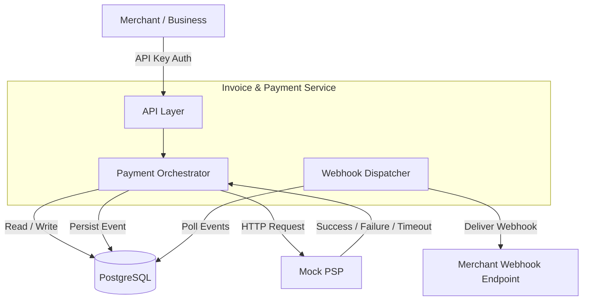
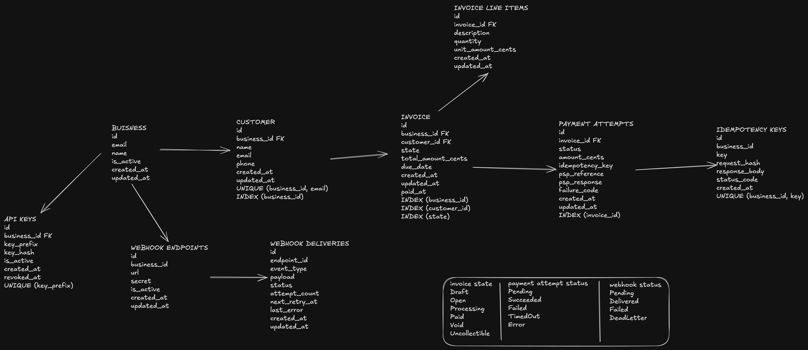

# Invoice & Payment Service

## Overview

This service enables businesses (merchants) to:

- Create and manage customers.
- Create invoices for customers.
- Process invoice payments through an external Payment Service Provider (PSP).
- Receive webhook notifications for invoice and payment events.

The system treats the PSP as an external dependency and is responsible for maintaining invoice state, payment attempt state, and webhook delivery reliability.

---

## High Level Architecture

---

## Core Domain Entities

### Business

Represents a merchant using the platform.

Responsibilities:

- Own customers.
- Own invoices.
- Own webhook endpoints.
- Authenticate using API keys.

---

### Customer

Represents an end customer belonging to a business.

Responsibilities:

- Receive invoices.
- Make payments.

---

### Invoice

Represents a bill issued to a customer.

Responsibilities:

- Track invoice amount.
- Track invoice state.
- Maintain payment history through payment attempts.

---

### Invoice Line Item

Represents a billable item within an invoice.

Responsibilities:

- Description
- Quantity
- Unit price

---

### Payment Attempt

Represents a single attempt to collect payment for an invoice.

Responsibilities:

- Track PSP interaction.
- Track payment outcome.
- Maintain PSP reference identifiers.

---

### Webhook Endpoint

Represents a merchant-owned endpoint that receives event notifications.

Responsibilities:

- Receive invoice and payment lifecycle events.

---

### Webhook Delivery

Represents an individual webhook delivery attempt.

Responsibilities:

- Track delivery status.
- Track retries and failures.

---

## Invoice Lifecycle

- Draft
  - Invoice has been created but not finalized.

- Open
  - Invoice has been finalized and issued to the customer.
  - Awaiting payment.

- Processing
  - A payment attempt is currently being processed.
  - Prevents concurrent payment attempts for the same invoice.

- Paid
  - Full payment has been successfully received and reconciled.
  - Terminal state.

- Void
  - Invoice has been cancelled by the merchant.
  - Terminal state.

- Uncollectible
  - Invoice has been written off as bad debt.
  - Terminal state.

---

## Payment Attempt Lifecycle

- Pending
  - Payment attempt has been created.
  - PSP request is in-flight.

- Succeeded
  - PSP returned a successful response.
  - Terminal state.

- Failed
  - PSP returned a definitive failure.
  - Examples:
    - insufficient_funds
    - card_declined

  - Terminal state.

- TimedOut
  - PSP request exceeded the configured timeout threshold.
  - Payment outcome is unknown.
  - Terminal state.

- Error
  - Network failure or PSP internal error occurred.
  - Terminal state.

## PSP Token Behaviour

- tok_success
  - Returns:
    `{ status: "succeeded", psp_ref: <uuid> }`

- tok_insufficient_funds
  - Returns:
    `{ status: "failed", code: "insufficient_funds" }`

- tok_card_declined
  - Returns:
    `{ status: "failed", code: "card_declined" }`

- tok_timeout
  - Delays response for approximately 30 seconds before returning success.

- tok_network_error
  - Returns HTTP 500 or drops the connection.

---

## Schema Design

Primary Key Strategy

- UUIDv7 for all entities.
- Avoids predictable IDs.
- Better index locality than UUIDv4.
- Suitable for distributed systems.

