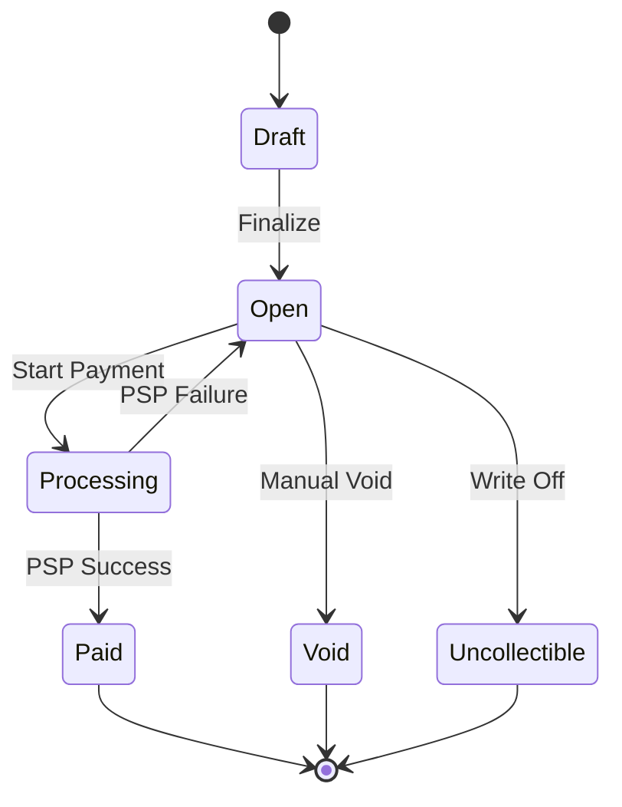

# Payment Service Architecture & Design

## Overview

This project implements a multi-tenant Invoice & Payment Service built using Rust (Actix Web), PostgreSQL, and SQLx. Businesses create customers and invoices, customers pay invoices through a mock Payment Service Provider (PSP), and businesses receive lifecycle notifications through webhooks.

The design prioritizes correctness over feature breadth. Particular attention is paid to payment idempotency, invoice state transitions, tenant isolation, and failure handling when communicating with external systems.

---

# 1. Data Model

## Entity Relationship Overview

Business
├── ApiKeys
├── Customers
├── Invoices
│ ├── InvoiceLineItems
│ └── PaymentAttempts
├── WebhookEndpoints
│ └── WebhookDeliveries
└── IdempotencyKeys

---

## businesses

Purpose:
Represents a tenant of the platform.

Key fields:

- id (UUID PK)
- email
- name
- is_active

Indexes:

- PRIMARY KEY(id)
- UNIQUE(email)

Why:

Businesses own all other resources. Every customer, invoice, payment attempt, webhook endpoint, and idempotency key is scoped to a business.

100x Scale:

Move to UUIDv7 and potentially shard by business_id.

---

## api_keys

Purpose:

Server-to-server authentication.

Key fields:

- business_id
- key_prefix
- key_hash
- revoked_at

Indexes:

- UNIQUE(key_prefix)
- INDEX(business_id)

Why hash + prefix:

The prefix allows efficient lookup without scanning all keys. Only the SHA-256 hash is stored, so leaked database contents do not reveal active API keys.

100x Scale:

Move hashes into a dedicated authentication service or cache frequently accessed prefixes in Redis.

---

## customers

Purpose:

Represents invoice recipients.

Key fields:

- business_id
- name
- email
- phone

Indexes:

- UNIQUE(business_id, email)
- INDEX(business_id)

Why:

Customer emails are unique only within a business. Different businesses may have customers with the same email.

---

## invoices

Purpose:

Represents a bill issued to a customer.

Key fields:

- customer_id
- state
- total_amount_cents
- due_date

Indexes:

- business_id
- customer_id
- state

Why store total_amount_cents:

The server computes totals from line items once and stores them. This avoids repeatedly calculating totals during payment flows.

Money is stored as integer cents. Floats are never used.

---

## invoice_line_items

Purpose:

Stores invoice contents.

Key fields:

- invoice_id
- description
- quantity
- unit_amount_cents

Why:

Line items are normalized for flexibility while invoice totals remain denormalized for performance.

---

## payment_attempts

Purpose:

Immutable audit log of payment processing attempts.

Key fields:

- invoice_id
- status
- amount_cents
- card_token
- psp_ref
- failure_code

Statuses:

- Pending
- Succeeded
- Failed
- TimedOut
- Error

Why:

Every interaction with the PSP is preserved for debugging, auditing, and reconciliation.

100x Scale:

Partition by created_at month.

---

## webhook_endpoints

Purpose:

Stores merchant webhook destinations.

Key fields:

- business_id
- url
- secret

Why:

Each business may subscribe to events independently.

---

## webhook_deliveries

Purpose:

Outbox table for webhook delivery.

Key fields:

- endpoint_id
- invoice_id
- event_type
- status
- next_retry_at

Why:

Webhook delivery is decoupled from API requests.

---

## idempotency_keys

Purpose:

Prevents duplicate payment processing.

Key fields:

- business_id
- key
- request_hash
- response_body
- expires_at

Indexes:

- UNIQUE(business_id, key)

Why:

Guarantees retries return the same result without issuing additional PSP calls.

---

# 2. Invoice State Machine



Terminal States:

- Paid
- Void
- Uncollectible

Valid Transitions:

| From       | To            | Trigger         |
| ---------- | ------------- | --------------- |
| Draft      | Open          | Finalize        |
| Open       | Processing    | Payment Start   |
| Processing | Paid          | PSP Success     |
| Processing | Open          | PSP Failure     |
| Open       | Void          | Merchant Action |
| Open       | Uncollectible | Merchant Action |

Invalid transitions are rejected using state-conditional updates:

```sql
UPDATE invoices
SET state='Processing'
WHERE id=$1
AND state='Open'
```

If no rows are updated, the transition is invalid.

---

# 3. Payment Correctness & Failure Modes

## (a) Two clients call POST /pay simultaneously

Only one request successfully transitions:

Open → Processing

using an atomic conditional update.

The winner proceeds to the PSP.

All others receive:

409 Conflict

No duplicate PSP calls occur.

Chosen mechanism:

State-conditional update.

Why:

Simpler than advisory locks while still preventing double charges.

---

## (b) PSP timeout (tok_timeout)

The billing service uses a 10-second outbound timeout.

If exceeded:

- PaymentAttempt = TimedOut
- Invoice returns to Open

The caller receives an error response.

The invoice remains payable.

---

## (c) PSP success but service crashes before persistence

The PSP reference (psp_ref) is stored on successful completion.

If the request is retried:

- Existing payment attempts are checked.
- Idempotency cache is checked.

The operation is treated as already completed.

No second charge is created.

---

## (d) Idempotency key reused with different request body

Stored request_hash is compared against the incoming request hash.

If different:

409 Conflict

This prevents clients from accidentally mutating requests under an existing idempotency key.

---

## (e) Paying an already-paid invoice

Paid is terminal.

Any additional payment request receives:

422 Unprocessable Entity

No PSP call is made.

---

# 4. Webhook Design

## Events

- invoice.created
- invoice.paid
- invoice.payment_failed

## Signing

Algorithm:

HMAC-SHA256

Headers:

X-Dodo-Signature
X-Dodo-Timestamp

Signed payload:

timestamp + request body

Replay protection:

Receivers reject timestamps older than 5 minutes.

---

## Retry Policy

Attempt 1: Immediate

Attempt 2: 1 minute

Attempt 3: 5 minutes

Attempt 4: 15 minutes

Attempt 5: 1 hour

Attempt 6: 6 hours

After final failure:

Status = DeadLetter

---

## Why Decoupled

Webhook delivery occurs asynchronously using the webhook_deliveries outbox table.

The API response never waits for external webhook consumers.

Benefits:

- Lower latency
- Better reliability
- No cascading failures

---

# 5. API Key Model

Generation:

dodo*live*<prefix>.<secret>

Storage:

- Prefix stored plaintext
- Full key SHA-256 hashed

Transmission:

Authorization: Bearer <api_key>

Rotation:

Create new key and revoke old key.

Revocation:

- is_active = false
- revoked_at populated

Blast Radius:

If a database leaks, attackers obtain only hashes and prefixes, not usable API keys.

---

# 6. What I Cut and Why

1. Kafka/RabbitMQ-based event infrastructure
   - PostgreSQL outbox was sufficient.

2. Automatic overdue invoice transitions
   - Added complexity outside core payment flow.

3. Refunds
   - Explicitly out of scope.

4. Multi-currency support
   - Assignment specifies USD only.

5. OAuth/JWT authentication
   - API key authentication satisfies requirements.

---

# 7. Production Readiness Gap

1. Observability
   - OpenTelemetry tracing.
   - Prometheus metrics.

2. Rate Limiting
   - Redis token bucket.

3. Secrets Management
   - AWS Secrets Manager / Vault.

4. Data Lifecycle Management
   - Partition payment_attempts and webhook_deliveries.

5. Stronger Key Hashing
   - Consider Argon2id for API keys.

6. Dead Letter Queue Dashboard
   - Merchant visibility into failed webhook deliveries.

7. Reconciliation Jobs
   - Periodically verify PSP state against local state.
