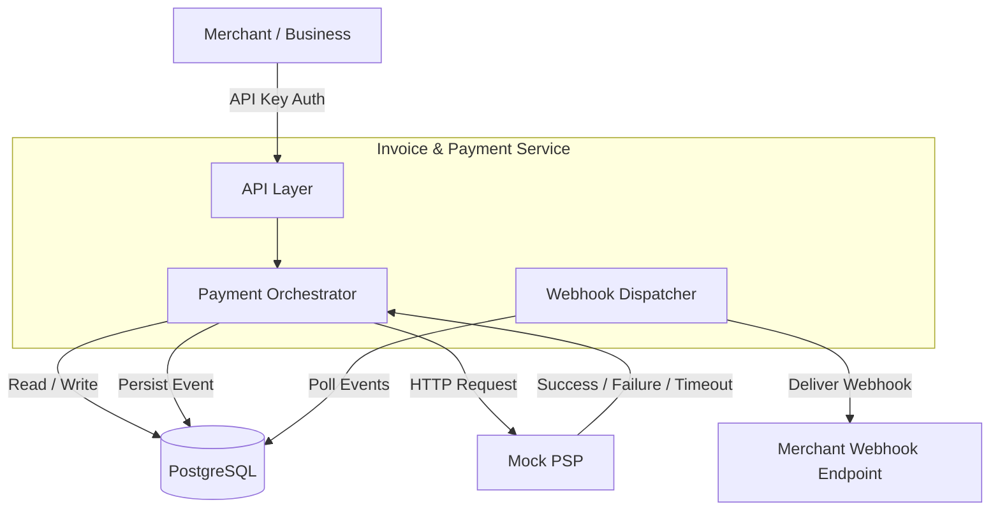

# Invoice & Payment Service

## Overview

This service enables businesses (merchants) to:

- Create and manage customers.
- Create invoices for customers.
- Process invoice payments through an external Payment Service Provider (PSP).
- Receive webhook notifications for invoice and payment events.

The system treats the PSP as an external dependency and is responsible for maintaining invoice state, payment attempt state, and webhook delivery reliability.

---

## High Level Architecture

---

## Core Domain Entities

### API Key Authentication

API keys identify a business and are the primary authentication mechanism for the public API.

Recommended key format:

- `dodo_live_<prefix>.<secret>`

Security and storage choices:

- Store the `prefix` in plaintext so the middleware can do a fast lookup.
- Store only a SHA-256 hash of the full API key secret portion for verification.
- Do not store or return the full raw API key after creation.

Why this design:

- A prefix lookup avoids scanning every key in the database on each request.
- Hashing the full key means a database leak does not expose usable API keys.
- Returning the key only once matches standard secret-handling behavior for tokens and webhook secrets.

Transmission:

- Clients send the key in the `Authorization: Bearer <api_key>` header.
- The API key middleware extracts the prefix, loads the key record, hashes the presented key, and compares the hash before injecting the authenticated business into request context.
- API keys MUST only be used over HTTPS.

Revocation:

- Revoke by marking the key inactive and setting a revocation timestamp.
- Middleware must reject revoked or inactive keys even if the hash still matches.
- Never delete keys immediately if auditability matters; retain the record for traceability and incident response.

Operational guidance:

- Show the full API key only once at creation time.
- Allow merchants to list existing keys, but redact the secret value.
- Prefer per-business key isolation so each merchant can rotate or revoke keys independently without affecting others.

### Business

Represents a merchant using the platform.

Responsibilities:

- Own customers.
- Own invoices.
- Own webhook endpoints.
- Authenticate using API keys.

---

### Customer

Represents an end customer belonging to a business.

Responsibilities:

- Receive invoices.
- Make payments.

---

### Invoice

Represents a bill issued to a customer.

Responsibilities:

- Track invoice amount.
- Track invoice state.
- Maintain payment history through payment attempts.

---

### Invoice Line Item

Represents a billable item within an invoice.

Responsibilities:

- Description
- Quantity
- Unit price

---

### Payment Attempt

Represents a single attempt to collect payment for an invoice.

Responsibilities:

- Track PSP interaction.
- Track payment outcome.
- Maintain PSP reference identifiers.

---

### Webhook Endpoint

Represents a merchant-owned endpoint that receives event notifications.

Responsibilities:

- Receive invoice and payment lifecycle events.

Security notes:

- Signing secret storage: the platform stores the webhook signing secret as a server-generated value (stored in plaintext in the database). This is acceptable because the secret is a system-generated HMAC secret (not a user password). Treat it as write-once/display-once: the secret SHOULD be returned to the merchant immediately after creation for copy-and-store, but MUST NOT be returned in API responses afterward.
- API behaviour: when a merchant creates a webhook endpoint, return the secret once and then redact it from subsequent reads/updates. Optionally store only a hash for verification aids, but remember HMAC verification requires access to the raw secret when sending webhooks.

---

### Webhook Delivery

Represents an individual webhook delivery attempt.

Responsibilities:

- Track delivery status.
- Track retries and failures.

---

## Invoice Lifecycle

- Draft
  - Invoice has been created but not finalized.

- Open
  - Invoice has been finalized and issued to the customer.
  - Awaiting payment.

- Processing
  - A payment attempt is currently being processed.
  - Prevents concurrent payment attempts for the same invoice.

- Paid
  - Full payment has been successfully received and reconciled.
  - Terminal state.

- Void
  - Invoice has been cancelled by the merchant.
  - Terminal state.

- Uncollectible
  - Invoice has been written off as bad debt.
  - Terminal state.

---

## Payment Attempt Lifecycle

- Pending
  - Payment attempt has been created.
  - PSP request is in-flight.

- Succeeded
  - PSP returned a successful response.
  - Terminal state.

- Failed
  - PSP returned a definitive failure.
  - Examples:
    - insufficient_funds
    - card_declined

  - Terminal state.

- TimedOut
  - PSP request exceeded the configured timeout threshold.
  - Payment outcome is unknown.
  - Terminal state.

- Error
  - Network failure or PSP internal error occurred.
  - Terminal state.

## PSP Token Behaviour

- tok_success
  - Returns:
    `{ status: "succeeded", psp_ref: <uuid> }`

- tok_insufficient_funds
  - Returns:
    `{ status: "failed", code: "insufficient_funds" }`

- tok_card_declined
  - Returns:
    `{ status: "failed", code: "card_declined" }`

- tok_timeout
  - Delays response for approximately 30 seconds before returning success.

- tok_network_error
  - Returns HTTP 500 or drops the connection.

---

## Schema Design

Primary Key Strategy

- UUIDv7 for all entities.
- Avoids predictable IDs.
- Better index locality than UUIDv4.
- Suitable for distributed systems.

